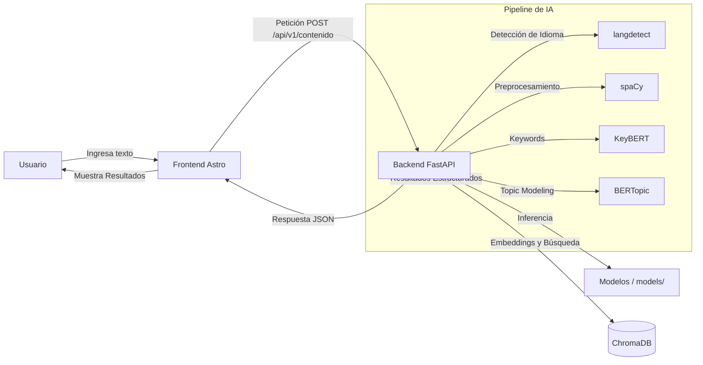

# TechMind 🧠

  

TechMind es una plataforma avanzada basada en **Procesamiento de Lenguaje Natural (NLP)** diseñada para analizar, clasificar y extraer metadatos de documentos y contenidos técnicos. Combina la eficiencia de **FastAPI** (Backend) con un frontend rápido y moderno construido en **Astro**, todo respaldado por un pipeline de IA robusto que utiliza **spaCy, BERTopic y SentenceTransformers**.

> **Disclaimer de Ciberseguridad**  
> This project is for educational and ethical cybersecurity purposes only.

---

## 🎯 ¿Qué es TechMind y qué problema resuelve?

En el ámbito técnico y corporativo, existe una sobrecarga de información. Los documentos y contenidos (manuales, reportes, tickets de soporte) suelen estar desestructurados, lo que dificulta la búsqueda y organización.

**TechMind** resuelve este problema al:
- **Analizar textos** automáticamente para entender su contexto.
- **Extraer keywords (palabras clave)** relevantes usando modelos como KeyBERT.
- **Clasificar el contenido (Topic Modeling)** en categorías predefinidas o inferidas utilizando BERTopic.
- **Detectar el idioma** para asegurar que el contenido se procesa de forma adecuada.

Todo esto se presenta a través de una interfaz de usuario interactiva y rápida que permite a los usuarios introducir textos, analizar su contenido y visualizar los resultados estructurados (tópicos, palabras clave, confianza del modelo, etc.).

---

## 🏗️ Estructura del Proyecto

El repositorio está organizado utilizando una arquitectura monolítica pero lógicamente separada, donde el frontend y el backend conviven en el mismo repositorio pero mantienen su independencia.

```text
G9-LATAM-Team-49-TechMind/
│
├── src/                    ← Frontend Astro (Componentes, layouts, páginas)
├── public/                 ← Recursos estáticos públicos del Frontend
├── package.json            ← Dependencias de Node.js (Frontend)
├── astro.config.mjs        ← Configuración de Astro
├── tsconfig.json           ← Configuración de TypeScript
│
├── backend/                ← Backend FastAPI
│   ├── main.py             ← Punto de entrada de la API
│   ├── api/routes/         ← Controladores de rutas
│   ├── schemas/            ← Contratos Pydantic de entrada y salida
│   ├── services/           ← Carga del modelo e integración con OCI
│   ├── ml/core.py          ← Núcleo de inferencia NLP
│   ├── requirements.txt    ← Dependencias de Python
│   └── Dockerfile          ← Dockerfile para el contenedor del backend
│
├── models/                 ← Modelos de IA serializados (.joblib, .pt)
├── chroma_db/              ← Base de datos vectorial persistente
├── configs/                ← Configuraciones y datos auxiliares
├── scripts/                ← Scripts de entrenamiento y automatización
├── tests/                  ← Pruebas unitarias
├── notebooks/              ← Jupyter Notebooks de experimentación
├── docs/                   ← Documentación adicional
│
├── Dockerfile              ← Dockerfile para el Frontend Astro
├── docker-compose.yml      ← Orquestación de contenedores (Frontend + Backend)
├── .env.example            ← Ejemplo de variables de entorno
└── README.md               ← Documentación principal
```

### Explicación de los directorios:
- **`src/` y Raíz (`package.json`, `astro.config.mjs`)**: Contiene todo el código del Frontend en Astro. Astro genera sitios web extremadamente rápidos con su arquitectura de islas.
- **`backend/`**: Contiene la API REST desarrollada en FastAPI. Expone los endpoints para interactuar con los modelos de IA.
- **`models/`**: Directorio donde el backend carga los modelos pre-entrenados para hacer la inferencia rápida (topic modeling, extracción de palabras clave).
- **`chroma_db/`**: Almacena embeddings localmente.
- **`scripts/`**: Scripts útiles, como `entrenar.py` para entrenar modelos o procesar el corpus de texto inicial.

---

## ⚙️ Arquitectura

La arquitectura de TechMind está diseñada para ser escalable, contenerizada y completamente desacoplada.



### Flujo de Funcionamiento:
1. El **Usuario** accede al **Frontend en Astro**, el cual es servido de manera estática a través de un servidor Nginx.
2. El usuario introduce un texto a analizar y el Frontend envía una petición HTTP al **Backend FastAPI**.
3. El **Backend FastAPI** recibe la petición, valida los datos mediante Pydantic y ejecuta el servicio NLP.
4. El **Pipeline NLP**:
   - Detecta el idioma del texto.
   - Si es compatible, utiliza **spaCy** para limpieza de texto (tokenización, remoción de stop-words).
   - Utiliza **KeyBERT** para extraer las palabras clave más importantes.
   - Pasa el texto por el modelo de **BERTopic** (cargado desde `/models`) para clasificarlo en tópicos.
   - (Opcional) Interactúa con **ChromaDB** para búsquedas vectoriales.
5. El Backend devuelve un JSON estructurado con el análisis.
6. El Frontend Astro renderiza los resultados (palabras clave, tópicos detectados) de forma clara y visual para el usuario.

---

## 🚀 Despliegue con Docker (Recomendado)

El proyecto está dockerizado para garantizar la consistencia entre entornos (Local, Producción, OCI).

### Prerrequisitos
- Docker
- Docker Compose

### Pasos
1. **Clonar el repositorio**:
   ```bash
   git clone https://github.com/No-Country-simulation/G9-LATAM-Team-49-TechMind.git
   cd G9-LATAM-Team-49-TechMind
   ```

2. **Configurar las variables de entorno**:
   Copia el archivo de ejemplo y modifícalo si es necesario.
   ```bash
   cp .env.example .env
   ```
   > Deja `PUBLIC_API_URL` **vacío**: el frontend llamará a rutas relativas y nginx hará de proxy inverso hacia la API. Todo el tráfico entra por el puerto 80, así que no hay que abrir el 8000 ni lidiar con CORS.

3. **Obtener los artefactos del modelo**. El endpoint de análisis no funciona sin ellos. Dos vías:
   - **Entrenar en local** (unos minutos): `python scripts/entrenar.py --offline`. Deja los seis artefactos en `models/`.
   - **Descargar de OCI Object Storage**: define `OCI_PAR_URL` en el `.env`. El contenedor los descarga al arrancar. Ver [docs/OCI_DEPLOYMENT.md](docs/OCI_DEPLOYMENT.md).

4. **Construir e iniciar los servicios**:
   ```bash
   docker compose up --build -d
   docker compose logs -f api      # el primer arranque carga los modelos
   ```
   Esto levantará dos contenedores:
   - **frontend** (nginx + Astro + proxy a la API): puerto `80`, público.
   - **api** (FastAPI): puerto `8000`, accesible solo desde la propia máquina.

5. **Acceder al sistema**:
   - Web App: [http://localhost](http://localhost)
   - Swagger: [http://localhost/docs](http://localhost/docs)
   - Estado del modelo: [http://localhost/health](http://localhost/health)

---

## 📡 Cómo utilizar la API

La API expone un endpoint de procesamiento y dos de salud. Todas las respuestas son JSON.

| Método | Ruta | Descripción |
|---|---|---|
| `POST` | `/api/v1/contenido` | Procesa un contenido técnico y devuelve categoría, palabras clave, entidades y tópico |
| `GET` | `/health` | *Readiness*: `200` solo si el modelo está cargado; `503` si no |
| `GET` | `/health/live` | *Liveness*: `200` mientras el proceso responda |
| `GET` | `/docs` | Documentación interactiva (Swagger UI) |

**URL base:** `http://<host>` con el proxy inverso de nginx (recomendado), o `http://<host>:8000` si llamas a la API directamente.

### Cuerpo de la petición

| Campo | Tipo | Obligatorio | Restricciones |
|---|---|---|---|
| `titulo` | `string` | Sí | 3 – 300 caracteres |
| `texto` | `string` | Sí | 20 – 50 000 caracteres |
| `n_keywords` | `int` | No | 1 – 50. Por defecto, el del modelo |
| `id_externo` | `string` | No | Máx. 64 caracteres. Se propaga a `doc_id` |

### Ejemplo 1 — Clasificación de contenido Backend

```bash
curl -X POST http://localhost/api/v1/contenido \
  -H "Content-Type: application/json" \
  -d '{
    "titulo": "Introducción a Spring Boot",
    "texto": "En este contenido se presentan los conceptos básicos para la creación de APIs REST utilizando Java y Spring Boot, incluyendo inyección de dependencias, controladores y validación de peticiones."
  }'
```

```json
{
  "categoria": "Backend",
  "probabilidad": 0.8912,
  "informacion_adicional": ["spring boot", "apis rest", "java", "inyección de dependencias", "controladores"],
  "doc_id": "a3f9c1e2b7d84a55",
  "tiempo_ms": 412.7,
  "titulo": "Introducción a Spring Boot",
  "idioma": {"codigo": "es", "confianza": 0.99, "soportado": true},
  "tema": {"id": 3, "etiqueta": "frameworks web · java · rest"},
  "entidades_tecnicas": ["Java", "Spring Boot", "API REST"],
  "distribucion_categorias": {"Backend": 0.8912, "DevOps": 0.0721, "Data": 0.0367},
  "metricas_texto": {"n_tokens": 24, "n_caracteres": 198, "n_palabras": 31},
  "explicacion": {},
  "relacionados": [],
  "advertencias": []
}
```

### Ejemplo 2 — Limitar las palabras clave y trazar con `id_externo`

```bash
curl -X POST http://localhost/api/v1/contenido \
  -H "Content-Type: application/json" \
  -d '{
    "titulo": "Contenedores y CI/CD",
    "texto": "Guía práctica para containerizar una aplicación con Docker y publicarla en Kubernetes mediante un pipeline de integración continua.",
    "n_keywords": 3,
    "id_externo": "doc-2026-0817"
  }'
```

```json
{
  "categoria": "DevOps",
  "probabilidad": 0.8134,
  "informacion_adicional": ["docker", "kubernetes", "integración continua"],
  "doc_id": "doc-2026-0817",
  "tiempo_ms": 388.2,
  "titulo": "Contenedores y CI/CD",
  "idioma": {"codigo": "es", "confianza": 0.99, "soportado": true},
  "tema": {"id": 1, "etiqueta": "contenedores · despliegue"},
  "entidades_tecnicas": ["Docker", "Kubernetes"],
  "distribucion_categorias": {"DevOps": 0.8134, "Backend": 0.1102, "Data": 0.0764},
  "metricas_texto": {"n_tokens": 18, "n_caracteres": 131, "n_palabras": 20},
  "explicacion": {},
  "relacionados": [],
  "advertencias": []
}
```

> Los valores concretos (probabilidades, tópicos, orden de las palabras clave) dependen del modelo entrenado; la **forma** de la respuesta es siempre esta.

### Ejemplo 3 — Manejo de errores

Entrada demasiado corta. Pydantic la rechaza antes de llegar al modelo:

```bash
curl -i -X POST http://localhost/api/v1/contenido \
  -H "Content-Type: application/json" \
  -d '{"titulo": "Hola", "texto": "corto"}'
```

```http
HTTP/1.1 422 Unprocessable Entity
```

```json
{
  "detail": [
    {"type": "string_too_short", "loc": ["body", "texto"],
     "msg": "String should have at least 20 characters"}
  ]
}
```

El pipeline aplica una **segunda capa** de validación semántica (idioma no soportado, exceso de caracteres no alfabéticos, texto degenerado…), que también responde `422` pero con códigos propios:

```json
{
  "detail": [
    {"codigo": "idioma_no_soportado",
     "mensaje": "El idioma detectado (en) no está entre los soportados: es"}
  ]
}
```

Y si los artefactos del modelo no están disponibles, la API responde `503` con la explicación en lugar de un error genérico:

```json
{
  "detail": [
    {"codigo": "modelo_no_disponible",
     "mensaje": "Faltan los artefactos del modelo en /app/models: metadata.json, ..."}
  ]
}
```

### Códigos de estado

| Código | Significado |
|---|---|
| `200` | Contenido procesado correctamente |
| `422` | Entrada inválida (esquema o validación semántica) |
| `503` | El modelo no está cargado: faltan los artefactos. El `detail` explica cómo resolverlo |
| `500` | Error inesperado durante la inferencia |

### Consumo desde JavaScript

```javascript
const respuesta = await fetch('/api/v1/contenido', {
  method: 'POST',
  headers: { 'Content-Type': 'application/json' },
  body: JSON.stringify({ titulo, texto, n_keywords: 5 }),
});
const resultado = await respuesta.json();
console.log(resultado.categoria, resultado.informacion_adicional);
```

---

## 📦 Dependencias y versiones

**Backend** (`backend/requirements.txt`) — Python 3.10:

| Paquete | Versión | Uso |
|---|---|---|
| fastapi | ≥ 0.100.0 | Framework de la API REST |
| uvicorn[standard] | ≥ 0.23.0 | Servidor ASGI |
| pydantic | ≥ 2.0.0 | Validación de esquemas |
| spacy | ≥ 3.8.0 | Tokenización, lematización, POS, EntityRuler |
| es_core_news_sm | 3.8.x | Modelo lingüístico en español |
| sentence-transformers | ≥ 2.2.2 | Embeddings del texto |
| keybert | ≥ 0.8.3 | Extracción de palabras clave |
| bertopic | ≥ 0.16.0 | Modelado de tópicos |
| scikit-learn | ≥ 1.3.0 | Clasificador y métricas |
| chromadb | ≥ 0.4.15 | Base vectorial para búsqueda semántica |
| joblib | ≥ 1.3.2 | Serialización de artefactos |
| langdetect | ≥ 1.0.9 | Detección de idioma |
| yake | — | Extractor de keywords de respaldo |
| beautifulsoup4 | — | Limpieza de HTML |
| pandas / numpy | ≥ 2.0.3 / ≥ 1.24.3 | Manipulación de datos |
| torch (CPU) | — | Backend de sentence-transformers |
| oci | ≥ 2.126.0 *(opcional)* | Descarga de artefactos desde Object Storage |

**Frontend** (`package.json`) — Node ≥ 22.12: `astro ^7.2.3`, `tailwindcss ^4.3.3`, `@tailwindcss/vite ^4.3.3`.

Para un despliegue reproducible, genera las versiones exactas desde el contenedor que ya funciona:

```bash
docker compose exec api pip freeze > backend/requirements.lock.txt
```

---

## 💻 Entorno de Desarrollo Local (Sin Docker)

Si deseas desarrollar o debugear localmente sin contenedores:

### 1. Iniciar el Backend (FastAPI)
```bash
cd backend
python -m venv venv
# Linux/macOS
source venv/bin/activate
# Windows
.\venv\Scripts\activate

pip install -r requirements.txt
uvicorn main:app --reload --port 8000
```
> Asegúrate de que `models/` esté en la raíz del proyecto, el código resuelve la ruta dinámicamente o móntala correctamente si haces tests aislados.

### 2. Iniciar el Frontend (Astro)
En otra terminal, desde la raíz del proyecto:
```bash
npm install
npm run dev
```
La aplicación estará disponible en `http://localhost:4321`.

---

## 🧪 Pruebas

Para ejecutar las pruebas del backend, desde la **raíz** del proyecto:

```bash
# Linux / macOS
PYTHONPATH=backend PRECARGAR_MODELOS=0 pytest tests/ -v

# Windows (PowerShell)
$env:PYTHONPATH="backend"; $env:PRECARGAR_MODELOS="0"; pytest tests/ -v
```

`tests/test_integracion.py` ejercita el pipeline real (validación, idioma, spaCy, keywords, clasificación y serialización) con dobles ligeros, sin cargar modelos de varios GB. Requiere `es_core_news_sm` instalado.

---

## 🤝 Cómo Contribuir

¡Las contribuciones son bienvenidas! Sigue este flujo de trabajo:

1. Realiza un **Fork** de este repositorio.
2. Crea una rama para tu característica: `git checkout -b feature/nueva-caracteristica`
3. Confirma tus cambios usando *Conventional Commits*: `git commit -m "feat: agrega nueva clasificación"`
4. Sube los cambios a tu Fork: `git push origin feature/nueva-caracteristica`
5. Abre un **Pull Request (PR)** hacia la rama `main`.

---
*Mantenido por el equipo de TechMind.*
