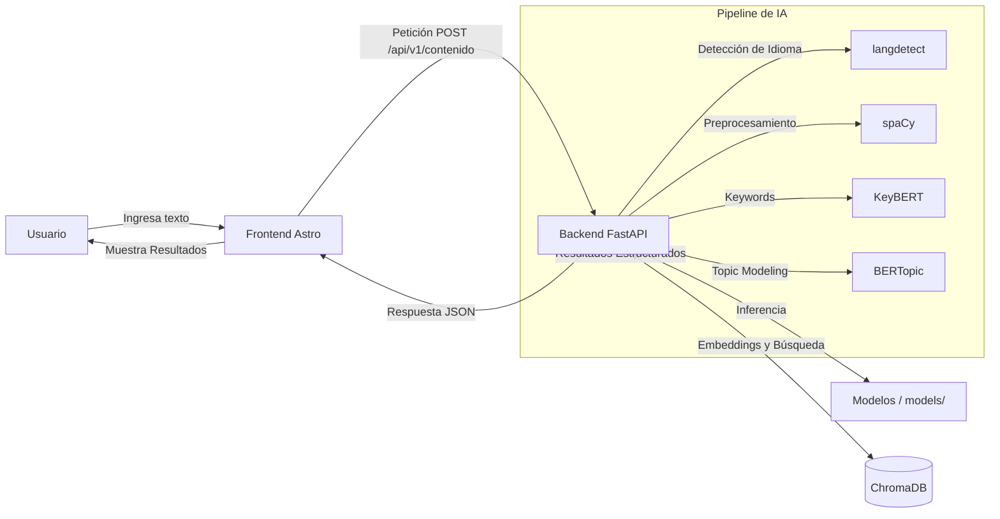

# TechMind 🧠

  

TechMind es una plataforma avanzada basada en **Procesamiento de Lenguaje Natural (NLP)** diseñada para analizar, clasificar y extraer metadatos de documentos y contenidos técnicos. Combina la eficiencia de **FastAPI** (Backend) con un frontend rápido y moderno construido en **Astro**, todo respaldado por un pipeline de IA robusto que utiliza **spaCy, BERTopic y SentenceTransformers**.

> **Disclaimer de Ciberseguridad**  
> This project is for educational and ethical cybersecurity purposes only.

---

## 🎯 ¿Qué es TechMind y qué problema resuelve?

En el ámbito técnico y corporativo, existe una sobrecarga de información. Los documentos y contenidos (manuales, reportes, tickets de soporte) suelen estar desestructurados, lo que dificulta la búsqueda y organización.

**TechMind** resuelve este problema al:
- **Analizar textos** automáticamente para entender su contexto.
- **Extraer keywords (palabras clave)** relevantes usando modelos como KeyBERT.
- **Clasificar el contenido (Topic Modeling)** en categorías predefinidas o inferidas utilizando BERTopic.
- **Detectar el idioma** para asegurar que el contenido se procesa de forma adecuada.

Todo esto se presenta a través de una interfaz de usuario interactiva y rápida que permite a los usuarios introducir textos, analizar su contenido y visualizar los resultados estructurados (tópicos, palabras clave, confianza del modelo, etc.).

---

## 🏗️ Estructura del Proyecto

El repositorio está organizado utilizando una arquitectura monolítica pero lógicamente separada, donde el frontend y el backend conviven en el mismo repositorio pero mantienen su independencia.

```text
G9-LATAM-Team-49-TechMind/
│
├── src/                    ← Frontend Astro (Componentes, layouts, páginas)
├── public/                 ← Recursos estáticos públicos del Frontend
├── package.json            ← Dependencias de Node.js (Frontend)
├── astro.config.mjs        ← Configuración de Astro
├── tsconfig.json           ← Configuración de TypeScript
│
├── backend/                ← Backend FastAPI
│   ├── main.py             ← Punto de entrada de la API
│   ├── routers/            ← Controladores de rutas
│   ├── services/           ← Lógica de negocio e integración de IA (NLP)
│   ├── requirements.txt    ← Dependencias de Python
│   └── Dockerfile          ← Dockerfile para el contenedor del backend
│
├── models/                 ← Modelos de IA serializados (.joblib, .pt)
├── chroma_db/              ← Base de datos vectorial persistente
├── configs/                ← Configuraciones y datos auxiliares
├── scripts/                ← Scripts de entrenamiento y automatización
├── tests/                  ← Pruebas unitarias
├── notebooks/              ← Jupyter Notebooks de experimentación
├── docs/                   ← Documentación adicional
│
├── Dockerfile              ← Dockerfile para el Frontend Astro
├── docker-compose.yml      ← Orquestación de contenedores (Frontend + Backend)
├── .env.example            ← Ejemplo de variables de entorno
└── README.md               ← Documentación principal
```

### Explicación de los directorios:
- **`src/` y Raíz (`package.json`, `astro.config.mjs`)**: Contiene todo el código del Frontend en Astro. Astro genera sitios web extremadamente rápidos con su arquitectura de islas.
- **`backend/`**: Contiene la API REST desarrollada en FastAPI. Expone los endpoints para interactuar con los modelos de IA.
- **`models/`**: Directorio donde el backend carga los modelos pre-entrenados para hacer la inferencia rápida (topic modeling, extracción de palabras clave).
- **`chroma_db/`**: Almacena embeddings localmente.
- **`scripts/`**: Scripts útiles, como `entrenar.py` para entrenar modelos o procesar el corpus de texto inicial.

---

## ⚙️ Arquitectura

La arquitectura de TechMind está diseñada para ser escalable, contenerizada y completamente desacoplada.



### Flujo de Funcionamiento:
1. El **Usuario** accede al **Frontend en Astro**, el cual es servido de manera estática a través de un servidor Nginx.
2. El usuario introduce un texto a analizar y el Frontend envía una petición HTTP al **Backend FastAPI**.
3. El **Backend FastAPI** recibe la petición, valida los datos mediante Pydantic y ejecuta el servicio NLP.
4. El **Pipeline NLP**:
   - Detecta el idioma del texto.
   - Si es compatible, utiliza **spaCy** para limpieza de texto (tokenización, remoción de stop-words).
   - Utiliza **KeyBERT** para extraer las palabras clave más importantes.
   - Pasa el texto por el modelo de **BERTopic** (cargado desde `/models`) para clasificarlo en tópicos.
   - (Opcional) Interactúa con **ChromaDB** para búsquedas vectoriales.
5. El Backend devuelve un JSON estructurado con el análisis.
6. El Frontend Astro renderiza los resultados (palabras clave, tópicos detectados) de forma clara y visual para el usuario.

---

## 🚀 Despliegue con Docker (Recomendado)

El proyecto está dockerizado para garantizar la consistencia entre entornos (Local, Producción, OCI).

### Prerrequisitos
- Docker
- Docker Compose

### Pasos
1. **Clonar el repositorio**:
   ```bash
   git clone https://github.com/No-Country-simulation/G9-LATAM-Team-49-TechMind.git
   cd G9-LATAM-Team-49-TechMind
   ```

2. **Configurar las variables de entorno**:
   Copia el archivo de ejemplo y modifícalo si es necesario.
   ```bash
   cp .env.example .env
   ```
   > **Nota de Producción**: Para despliegue remoto en OCI, el frontend leerá la variable `PUBLIC_API_URL` que se le pase durante el proceso de build. Modifica la IP en `docker-compose.yml` para el build context del frontend.

3. **Construir e iniciar los servicios**:
   ```bash
   docker compose up --build -d
   ```
   Esto levantará dos contenedores:
   - **frontend**: En el puerto `80`.
   - **api**: En el puerto `8000`.

4. **Acceder al sistema**:
   - Web App (Astro): [http://localhost](http://localhost)
   - Swagger / Documentación API: [http://localhost:8000/docs](http://localhost:8000/docs)

---

## 💻 Entorno de Desarrollo Local (Sin Docker)

Si deseas desarrollar o debugear localmente sin contenedores:

### 1. Iniciar el Backend (FastAPI)
```bash
cd backend
python -m venv venv
# Linux/macOS
source venv/bin/activate
# Windows
.\venv\Scripts\activate

pip install -r requirements.txt
uvicorn main:app --reload --port 8000
```
> Asegúrate de que `models/` esté en la raíz del proyecto, el código resuelve la ruta dinámicamente o móntala correctamente si haces tests aislados.

### 2. Iniciar el Frontend (Astro)
En otra terminal, desde la raíz del proyecto:
```bash
npm install
npm run dev
```
La aplicación estará disponible en `http://localhost:4321`.

---

## 🧪 Pruebas

Para ejecutar las pruebas del backend:
```bash
cd backend
pytest ../tests/ -v
```

---

## 🤝 Cómo Contribuir

¡Las contribuciones son bienvenidas! Sigue este flujo de trabajo:

1. Realiza un **Fork** de este repositorio.
2. Crea una rama para tu característica: `git checkout -b feature/nueva-caracteristica`
3. Confirma tus cambios usando *Conventional Commits*: `git commit -m "feat: agrega nueva clasificación"`
4. Sube los cambios a tu Fork: `git push origin feature/nueva-caracteristica`
5. Abre un **Pull Request (PR)** hacia la rama `main`.

---
*Mantenido por el equipo de TechMind.*
