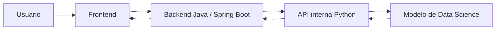

# TechMind: informe para desarrollar la API del modelo

Fecha de preparación: 3 de agosto de 2026  
Estado: propuesta de integración para el MVP; el contrato debe confirmarse entre Backend y el desarrollador de la API Python.

## 1. Propósito de esta entrega

Esta carpeta reúne el backend Java actual, el notebook ejecutado y las fuentes disponibles del trabajo de Data Science. Su objetivo es permitir que el desarrollador construya una API REST en Python alrededor del modelo y que posteriormente el backend Java pueda consumirla sin ejecutar código Python ni cargar archivos `joblib` directamente.

El alcance obligatorio del MVP es sencillo: recibir un título y un texto y devolver palabras clave ordenadas por relevancia. La clasificación, las entidades, los temas y las recomendaciones pueden conservarse dentro del modelo, pero no forman parte del contrato mínimo hasta que el equipo lo acuerde.

## 2. Arquitectura acordada



- El Frontend solamente se comunica con el backend Java.
- Java expone la API pública, valida la entrada y traduce errores.
- Python carga el modelo, ejecuta la inferencia y devuelve el resultado a Java.
- El modelo no debe cargarse en cada solicitud; debe cargarse una sola vez al iniciar la API Python.
- Para el MVP no se contemplan usuarios, autenticación ni almacenamiento de contenidos.
- La API Python es un servicio interno. No necesita CORS para el Frontend porque el navegador no debe llamarla directamente.

## 3. Estado del backend Java

Tecnologías actuales:

- Java 21.
- Spring Boot 4.1.0.
- Spring Web MVC.
- Jakarta Bean Validation.
- Maven Wrapper.

Endpoint público actual:

```http
POST /api/v1/keywords
Content-Type: application/json
```

Solicitud:

```json
{
  "title": "Introducción a Spring Boot",
  "text": "Spring Boot permite desarrollar aplicaciones y API REST con Java."
}
```

Respuesta:

```json
{
  "keywords": ["Spring Boot", "Java", "API REST"]
}
```

Validaciones públicas actuales:

- `title`: obligatorio y máximo de 200 caracteres.
- `text`: obligatorio y máximo de 20 000 caracteres.

El backend tiene una interfaz llamada `KeywordExtractor`. Actualmente utiliza `LocalKeywordExtractor`, una implementación provisional basada en frecuencia de palabras. Esa clase existe para que Frontend y Backend puedan probar el flujo mientras llega la API Python; no pretende sustituir el modelo.

Cuando la API Python esté disponible se creará otra implementación de `KeywordExtractor` que realizará una llamada HTTP. No es necesario que el desarrollador Python modifique el controlador Java.

Al preparar este informe se ejecutaron las pruebas del backend: 4 pruebas, 0 fallos y compilación exitosa.

## 4. Estado observado del modelo

El notebook ejecutado incluido en `modelo-python/techmind_eda_modelado_ejecutado.ipynb` demuestra que el pipeline se ejecutó en su entorno original:

- 370 documentos aceptados en 8 categorías.
- Modelo ganador de clasificación: TF-IDF y regresión logística.
- Exactitud de prueba aproximada: 0.8602.
- F1 macro de prueba aproximado: 0.8544.
- F1 macro de validación cruzada: 0.8532 ± 0.0488.
- Exactitud top-2 aproximada: 0.9677.
- Embeddings SBERT de 384 dimensiones.
- Generación de palabras clave y búsqueda semántica con ChromaDB demostradas dentro del notebook.
- Diez pruebas de cordura reportadas como aprobadas dentro de la ejecución del notebook.
- Latencia observada en un ejemplo: alrededor de 4.8 segundos en frío y entre 0.3 y 0.8 segundos en predicciones posteriores.

Esto demuestra funcionamiento dentro del notebook, pero todavía no demuestra que el modelo pueda arrancar de manera independiente como servicio.

### Riesgos que debe conocer el desarrollador Python

1. En los archivos recibidos no están los artefactos entrenados reales generados por la ejecución. El notebook menciona archivos como `modelo_clasificacion.joblib`, vectorizador, codificador de etiquetas, centroides, BERTopic, configuración y metadatos, pero no fueron entregados junto al notebook.
2. El ZIP generado por el notebook parece incluir únicamente la ruta de modelos. ChromaDB persistente, SQLite y otros archivos utilizados para recomendaciones pueden quedar fuera.
3. La generación de `techmind_core.py` reportó que no pudo extraer varias clases fundamentales, entre ellas `TechMindInference`. Ese archivo no debe considerarse utilizable hasta importarlo y probarlo en un proceso limpio.
4. El cargador `TechMindInference.desde_artefactos()` debe verificarse. En las fuentes actuales no restaura claramente todos los componentes usados en el notebook, como BERTopic, la colección ChromaDB y las reglas personalizadas de entidades de spaCy.
5. El notebook conserva referencias a FastAPI y al endpoint `/contenido`, pero el contrato descrito en este informe reemplaza esa suposición. El backend público es Java; FastAPI, si se utiliza, solo rodeará el modelo.
6. La subida a OCI no se ejecutó en el notebook (`SUBIR_A_OCI=False`). El despliegue y el requisito de OCI deben acordarse aparte.

## 5. Contrato interno propuesto entre Java y Python

Este contrato es una propuesta para desbloquear el desarrollo. Antes de considerarlo definitivo, ambos responsables deben confirmar nombres, límites y errores.

### Analizar contenido

```http
POST /api/v1/analyze
Content-Type: application/json; charset=utf-8
```

Solicitud:

```json
{
  "title": "Introducción a Spring Boot",
  "text": "Spring Boot permite desarrollar aplicaciones y API REST con Java."
}
```

Reglas propuestas:

- Ambos campos son cadenas obligatorias y no pueden quedar vacíos después de aplicar `trim`.
- `title` admite hasta 200 caracteres.
- `text` admite hasta 20 000 caracteres.
- La API devuelve como máximo 5 palabras o frases clave.
- Las palabras clave se devuelven de mayor a menor relevancia, sin duplicados y como texto UTF-8.

Respuesta mínima `200 OK`:

```json
{
  "keywords": [
    "Spring Boot",
    "Java",
    "API REST"
  ]
}
```

Para el primer contrato, `keywords` debe ser el único campo obligatorio. Si el equipo desea aprovechar más resultados del modelo, puede añadir después campos opcionales como `category`, `confidence`, `entities`, `topic` o `recommendations`. Java no debe depender de ellos hasta que se documenten y prueben.

### Estado del servicio

```http
GET /health
```

Respuesta cuando el modelo está listo, `200 OK`:

```json
{
  "status": "UP",
  "modelLoaded": true,
  "modelVersion": "2.0.0"
}
```

Si la aplicación web está viva pero el modelo no pudo cargarse, se propone responder `503 Service Unavailable` con `modelLoaded: false`.

### Errores

Formato estable propuesto:

```json
{
  "code": "VALIDATION_ERROR",
  "message": "El texto es obligatorio"
}
```

Estados que Java necesita distinguir:

- `400 Bad Request`: JSON mal formado.
- `422 Unprocessable Entity`: campos ausentes o inválidos.
- `500 Internal Server Error`: fallo inesperado durante la inferencia.
- `503 Service Unavailable`: modelo no cargado o servicio no listo.

La API no debe devolver trazas de Python ni rutas internas en el JSON. Puede registrarlas en sus logs.

## 6. Comportamiento esperado de la API Python

- Arrancar desde un entorno limpio utilizando solo código, dependencias declaradas y artefactos persistidos.
- Cargar todos los modelos una vez durante el arranque y marcar el servicio como listo solamente al finalizar.
- No depender de variables globales creadas previamente por Jupyter o Colab.
- Mantener el orden de las palabras clave y devolver resultados deterministas para una misma versión y entrada.
- Establecer versiones exactas de dependencias en `requirements.txt`, un archivo lock o `pyproject.toml`.
- Configurar rutas de artefactos mediante variables de entorno, sin rutas absolutas de Colab o Windows.
- No registrar el texto completo del usuario en producción; basta un identificador, duración y estado.
- Documentar consumo de memoria, tiempo de arranque y estrategia de workers. Cargar una copia completa del modelo por worker puede multiplicar la memoria utilizada.
- Proporcionar documentación OpenAPI. FastAPI puede generarla automáticamente.

Estructura sugerida para la entrega Python:

```text
model-api/
├── app/
│   ├── main.py
│   ├── config.py
│   ├── schemas.py
│   └── model_service.py
├── artifacts/
│   └── README.md
├── tests/
├── .env.example
├── Dockerfile
├── requirements.txt o pyproject.toml
└── README.md
```

## 7. Criterios de aceptación

La API se podrá conectar con Java cuando cumpla, como mínimo, lo siguiente:

1. Se instala y arranca siguiendo únicamente su README en un entorno nuevo.
2. `GET /health` confirma que el modelo fue cargado.
3. `POST /api/v1/analyze` acepta exactamente `title` y `text` y devuelve `keywords` como arreglo de cadenas.
4. Una entrada válida devuelve al menos una palabra clave y nunca más de cinco.
5. Entradas vacías, demasiado largas y JSON inválido producen respuestas controladas.
6. La API sigue funcionando después de reiniciarse, sin ejecutar primero el notebook.
7. Existen pruebas automáticas del endpoint, la validación y el fallo al cargar artefactos.
8. Se entrega la URL de desarrollo, el puerto, el contrato OpenAPI y las variables de entorno necesarias.
9. Se especifica qué archivos de artefactos son obligatorios y se verifica que todos estén incluidos.

## 8. Información que necesitamos del desarrollador

Antes de implementar el cliente Java definitivo necesitamos recibir:

- Confirmación o cambios al contrato propuesto.
- URL base y puerto del servicio.
- OpenAPI generado o ejemplos reales de cada respuesta.
- Tiempo máximo esperado de inferencia en frío y en caliente.
- Lista completa y versión de los artefactos cargados.
- Forma de ejecutar localmente la API y sus pruebas.
- Decisión sobre recomendaciones: excluidas del MVP o incluidas con un contrato adicional.
- Decisión de despliegue y de qué componente cumplirá el requisito de OCI.

## 9. Contenido de esta carpeta

- `backend-java/`: copia limpia del backend actual, sin `.git` ni `target`.
- `modelo-python/techmind_eda_modelado_ejecutado.ipynb`: notebook recibido con resultados de ejecución.
- `modelo-python/fuentes/`: scripts que generan el notebook y fuentes Python disponibles.
- `modelo-python/datos/`: CSV recibidos para la construcción o fallback del corpus.
- `modelo-python/CHANGELOG_v2.md`: notas técnicas incluidas por Data.
- `modelo-python/Comparativa_TechMind.pdf`: comparación técnica recibida con el modelo.
- `ejemplos/`: cuerpos JSON del contrato propuesto.

## 10. Próximo paso recomendado

Data debe entregar primero todos los artefactos persistidos. El desarrollador Python debe construir y probar el servicio en un proceso nuevo, sin ejecutar el notebook. Una vez que comparta un endpoint real y confirme su JSON, Backend sustituirá el extractor local por el cliente HTTP y añadirá las pruebas de integración correspondientes.
